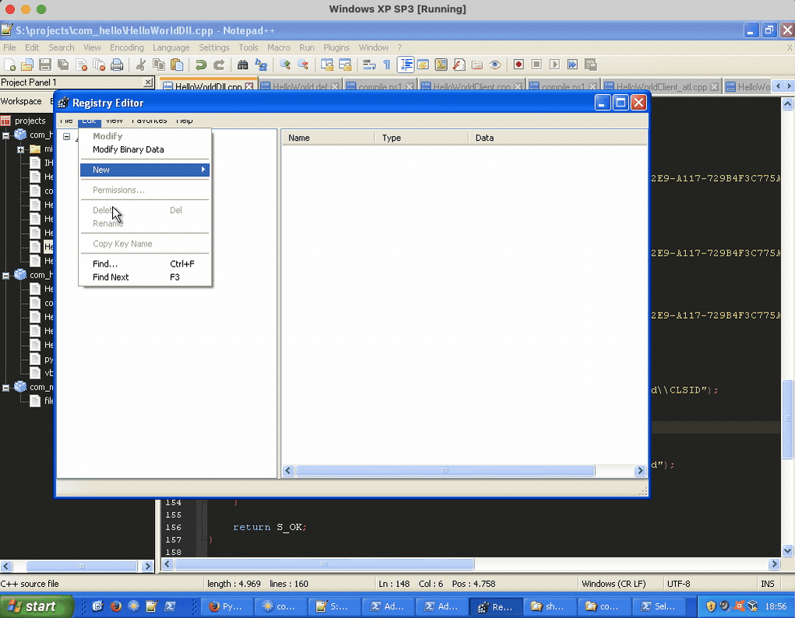
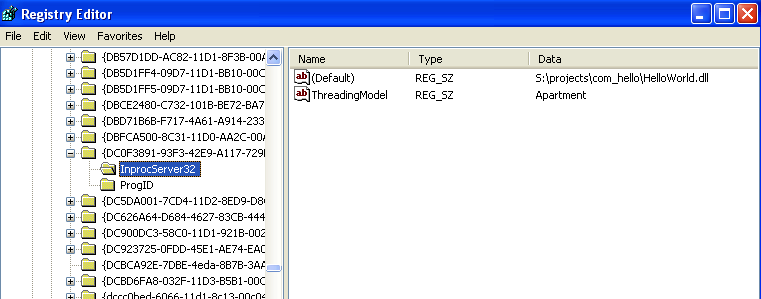
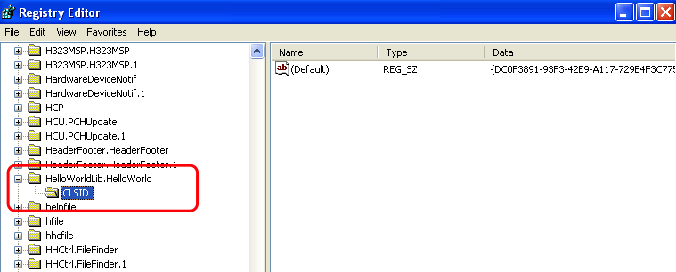
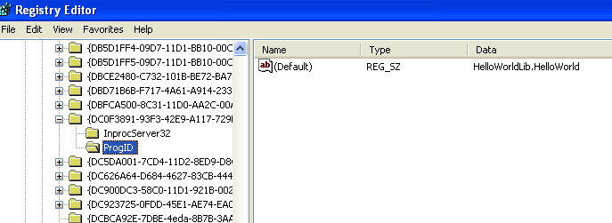
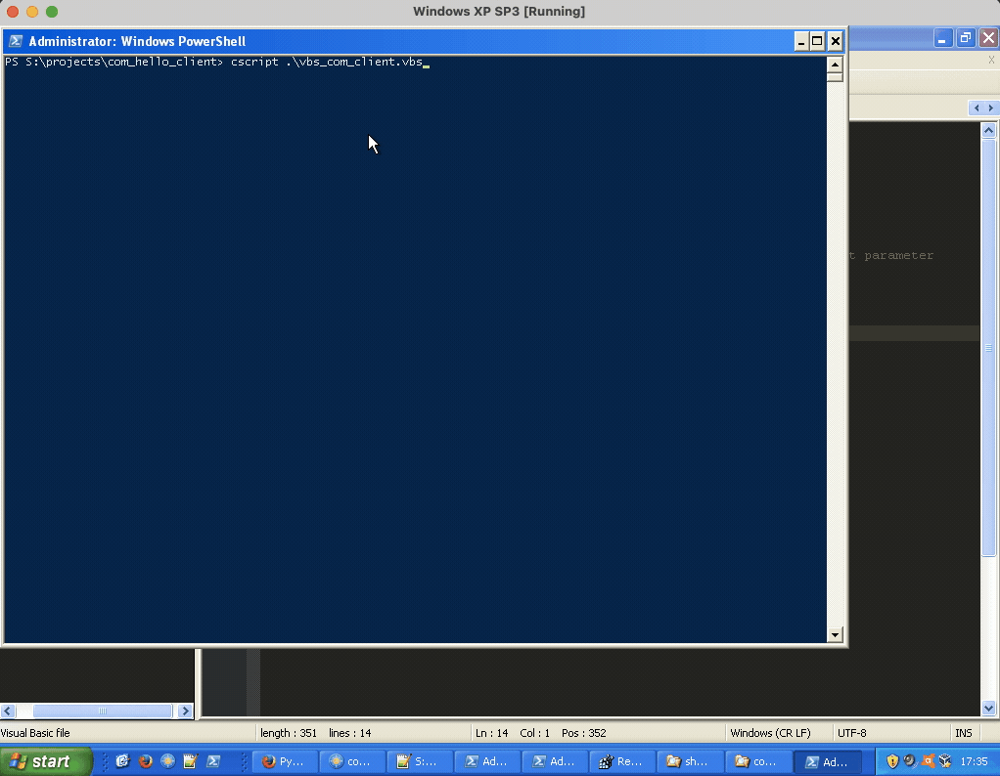

## Introduction (you can skip if you want)

Welcome, dear reader, to this guide! We will talk about COM. COM, or Component Object Model, is a way of doing things in Microsoft. It allows different parts of a program to talk to each other.

In this guide, we will make a COM component with our own hands. No frameworks. No fancy tools. Just us and the code. It's not the usual way, but it's fun and a good way to learn.

We will use Visual Studio 6, but not its graphical part. We need it only because it has a C++ compiler. We will write all the code ourselves, by hand.

Our workspace is an old system: Windows XP. It will run inside a virtual machine. A little bit old school, but good for learning.

We will write our code in Notepad++. It's simple and good enough for us. After writing the code, we will compile and run it from the console. That's all we need.

So, let's start our journey into the world of COM! It may be a bit old, but it's still important and good to know. Happy coding!

## Introduction

Before we begin, it's important to understand what COM (Component Object Model) is and why it's used. COM is a binary-interface standard that allows different software components to communicate with each other. It's widely used in Windows for creating and using custom and system-provided objects. If you've used Microsoft Office automation or written a Windows Shell extension, you've used COM.

COM is a complex topic, with numerous details and concepts. This tutorial focuses on creating a simple COM object, and it doesn't cover all aspects of COM.

## Step 1: Create IDL file

The first stepping stone on our journey through the depths of COM is the Interface Definition Language (IDL) file. This file holds the blueprint of the interfaces that our COM object will adhere to. Every interface is specified in this IDL file with a unique identifier, the universally recognized GUID (Globally Unique Identifier). This GUID serves as the passport for the interface, allowing it to be recognized and utilized across different systems and languages.

```cpp
import "oaidl.idl";
import "ocidl.idl";

[
    uuid("A851A7FE-4903-48AF-A694-51FEB755EE5B"),
    helpstring("IHelloWorld Interface"),
    dual,
    oleautomation
]
interface IHelloWorld : IDispatch{
    [helpstring("method SayHello"), id(1)] HRESULT SayHello();
    [helpstring("method SayHelloStr"), id(2)] HRESULT SayHelloStr([out, retval] BSTR* greeting);
    [helpstring("method SayHelloTo"), id(3)] HRESULT SayHelloTo([in] BSTR name, [out, retval] BSTR* greeting);
};

[
    uuid("9EBDD250-565C-4182-B5E9-70CF63A896E1"),
    helpstring("HelloWorldLib Type Library"),
    version(1.0)
]
library HelloWorldLib
{
    importlib("stdole32.tlb");
    importlib("stdole2.tlb");

    [
        uuid("DC0F3891-93F3-42E9-A117-729B4F3C775A"),
        helpstring("HelloWorld Class")
    ]
    coclass HelloWorld
    {
        [default] interface IHelloWorld;
    };
}
```

Here, we have an IDL file that lays out a COM interface, `IHelloWorld`, comprised of three methods: `SayHello`, `SayHelloStr`, and `SayHelloTo`. The file also defines a `coclass`, HelloWorld, which is marked out to implement this interface.

Prior to laying down the details of the interface, we import two necessary IDL files, "oaidl.idl" and "ocidl.idl". These files contain the scaffolding for the IDispatch interface among other fundamental definitions vital to the COM architecture.

The `IDispatch` interface is of particular importance in the COM universe. It enables late binding to COM objects, allowing clients to invoke methods and access properties at runtime without prior knowledge during compile time. It is the backbone of the OLE Automation system, a standard protocol that allows applications to expose their features to other applications, even if they're written in different languages.

Our `IHelloWorld` interface methods return an HRESULT, which is the standard return type in COM. The interface is declared as `dual`; it supports both **early** and **late** binding, marking its compatibility with different interaction styles. It is also designed to work with OLE automation-compatible types, an aspect communicated by the `oleautomation` attribute.

The addition of `id` attributes to the methods within the interface ensures that these methods can be correctly identified within the `vtable`, allowing for proper invocation.

In COM, a vtable is a table of function pointers that enables dynamic method binding. Each interface method has an entry in the vtable that points to its implementation. When a client invokes a method on an interface, the COM runtime uses the vtable to find and call the correct method implementation. This vtable-based approach is crucial for the language-independent communication that COM provides.

Expanding on the HelloWorldLib library, we define our `coclass`, HelloWorld. This coclass has its own unique UUID and is specifically configured to implement the IHelloWorld interface as its `default`. It's essential to note that a single coclass in COM can implement multiple interfaces, making it a highly flexible unit of functionality. 

Navigating to an interface in the COM universe is akin to embarking on a journey. You first locate the library where the coclass that houses the interface is situated. After locating the coclass, you can then access the interface you're after. This is a top-down search process that's greatly facilitated by the Windows registry, which plays a pivotal role in locating the requisite library. 

So, remember, a coclass is not confined to implementing just a single interface, and this multiplicity of interface implementation is part of the robustness and versatility that COM offers.

We'll keep this file as `IHelloWorld.idl`.

We then use the **midl** (Microsoft Interface Definition Language) tool to generate the necessary headers and source files:

```powershell
midl /nologo /char signed /env win32 /Oicf IHelloWorld.idl
```

Here's a breakdown of what each flag is doing:

* /nologo: Suppresses the startup banner and information messages.
* /char signed: Treats the char data type as a signed character.
* /env win32: Specifies the target system environment. In this case, it's a 32-bit Windows environment.
* /Oicf: Optimizes for interpreter speed and stub code size.

You can add more options according to your needs. Here are a few of them:

* /app_config: Processes the application configuration file (if it exists) to customize the behavior of the MIDL compiler.
* /win64: Specifies the target system environment to be 64-bit Windows.
* /target NT60: Specifies the minimum version of Windows on which the resulting code should run.
* /proxy: Specifies the filename for the proxy file. This is useful if you want to provide a specific name to the proxy file.
* /out: Specifies the directory where the MIDL compiler places output files.

More info: https://learn.microsoft.com/en-us/windows/win32/midl/general-midl-command-line-syntax

If you want to keep the autogenerated files in a subfolder, first create one: 

`mkdir midl`

And then execute midl tool this way:

```powershell
midl /nologo /char signed /env win32 /Oicf /out ./midl IHelloWorld.idl
```

The `midl` command generates several files including `IHelloWorld.h` and `IHelloWorld_i.c`.

These files contain important details for your COM object.

1. **IHelloWorld.h**: It includes the interface declarations for all the interfaces you've defined in your IDL file. These declarations take the form of virtual function tables (vtables) and structures, which represent the interfaces and coclasses in your COM object. This file is essential because you include it in any source file that implements or uses your COM interfaces. The interface declarations within make it possible for both the implementers and the users of the interface to know exactly how to interact with it. This file is crucial in maintaining the contract between different parts of the COM object and its clients.

2. **IHelloWorld_i.c**: This C file contains the definitions of the Interface Identifier (IID) and Class Identifier (CLSID) constants for your interfaces and classes. These are the UUIDs you specified in your IDL file. Any code that needs to use your objects needs to be able to access these identifiers, and this file provides a convenient way of including those definitions in multiple source files.

So, in summary, these two files play a fundamental role in the structure and usage of your COM object. The `_i.c` file gives the definition of the unique identifiers for your interfaces and classes, while the `.h` file provides the interface declarations essential for any source file that needs to interact with your COM object.

*Hint*: Generating a GUID (Globally Unique Identifier) in Windows can be done in several ways. One way to do this is using the `guidgen.exe` utility that comes with the Visual Studio installation. Go to `Start > Programs > Microsoft Visual Studio 6.0 > Tools > GUIDGEN`.

### A note on TLB (Type Library) files

In addition to the aforementioned files, our midl command generates another important file: `IHelloWorld.tlb`. This is the Type Library (TLB) for our COM object. A TLB file is a binary description of our COM object's interfaces and classes. The TLB plays a significant role in two areas:

* Language Interoperability: TLB files enable COM objects to be used from languages other than the one they were written in. The runtime of these languages reads the TLB file to understand how to interact with the COM object. The TLB file carries the metadata of the COM object, defining its interfaces, methods, properties, and events. For instance, if you're using the COM object from Python or VBScript, they'll refer to the TLB file to learn how to communicate with it.

* Intellisense Support: Integrated Development Environments (IDEs) like Visual Studio use the TLB to provide autocompletion and context-sensitive help while you code. The IDE can read the TLB file and suggest the methods, properties, or events that can be called on the object. This feature streamlines coding and reduces errors by providing the right suggestions at the right time.

The process of creating and using a TLB file is mostly automated. When you use the midl tool to compile an IDL file, the TLB file is created automatically. When you use an object that needs the TLB file (e.g., when accessing the object from another programming language or from an IDE), the system or tooling will generally know to look for and how to use the TLB file. This seamless operation makes the TLB file a valuable, yet often invisible, asset in the COM ecosystem.

## Step 2: Implement the COM class

Here, we're creating a C++ class that implements the `IHelloWorld` interface we defined in the IDL. This includes the `SayHello*` methods, along with the `IUnknown` methods `AddRef`, `Release`, and `QueryInterface` which are standard for all COM objects. The `QueryInterface` method is used to obtain pointers to supported interfaces, while `AddRef` and `Release` manage the lifetime of the object.

The `IDispatch` interface is used for late binding, allowing methods to be called dynamically at runtime.

Save below header and sources in `HelloWorld.h`  respective `HelloWorld.cpp`.

```cpp
#pragma once
#include "./midl/IHelloWorld.h"

class HelloWorld : public IHelloWorld
{
    long m_cRef;

public:
    HelloWorld();

    // IUnknown methods
    HRESULT __stdcall QueryInterface(const IID& riid, void** ppv);
    ULONG __stdcall AddRef();
    ULONG __stdcall Release();

    // IDispatch methods
    HRESULT __stdcall GetTypeInfoCount(UINT* pctinfo);
    HRESULT __stdcall GetTypeInfo(UINT iTInfo, LCID lcid, ITypeInfo** ppTInfo);
    HRESULT __stdcall GetIDsOfNames(REFIID riid, LPOLESTR* rgszNames, UINT cNames, LCID lcid, DISPID* rgDispId);
    HRESULT __stdcall Invoke(DISPID dispIdMember, REFIID riid, LCID lcid, WORD wFlags, DISPPARAMS* pDispParams, VARIANT* pVarResult, EXCEPINFO* pExcepInfo, UINT* puArgErr);

    // IHelloWorld methods
	  HRESULT __stdcall SayHello();
    HRESULT __stdcall SayHelloStr(BSTR* greeting);
    HRESULT __stdcall SayHelloTo(BSTR name, BSTR* greeting);
};
```
---

```cpp
#include "HelloWorld.h"
#include <iostream>
#include <string>

// Constructor to initialize the reference count
HelloWorld::HelloWorld() : m_cRef(1) {}

// QueryInterface allows a client to obtain pointers to other interfaces on a given object
HRESULT __stdcall HelloWorld::QueryInterface(const IID& riid, void** ppv)
{
    // If the requested interface is IUnknown, IHelloWorld, or IDispatch,
    // we increment the ref count and return a pointer to it
    if (riid == IID_IUnknown || riid == IID_IHelloWorld || riid == IID_IDispatch)
    {
        *ppv = static_cast<IHelloWorld*>(this);
    }
    else
    {
        // If the requested interface does not exist, return an error
        *ppv = NULL;
        return E_NOINTERFACE;
    }
    // Increment the reference count before the pointer is returned
    reinterpret_cast<IUnknown*>(*ppv)->AddRef();
    return S_OK;
}

// AddRef method increments the reference count for an object
ULONG __stdcall HelloWorld::AddRef()
{
    // Use interlocked increment for thread safety
    return InterlockedIncrement(&m_cRef);
}

// Release method decrements the reference count for an object
ULONG __stdcall HelloWorld::Release()
{
    // Use interlocked decrement for thread safety
    ULONG ulRefCount = InterlockedDecrement(&m_cRef);
    // If reference count is 0, delete the object
    if (0 == m_cRef)
    {
        delete this;
    }
    return ulRefCount;
}

// GetTypeInfoCount method retrieves the number of type information interfaces that an object provides
HRESULT __stdcall HelloWorld::GetTypeInfoCount(UINT* pctinfo)
{
    // We're not providing any type info, so set the count to 0
    *pctinfo = 0;
    return S_OK;
}

// GetTypeInfo retrieves the type information for an object
HRESULT __stdcall HelloWorld::GetTypeInfo(UINT iTInfo, LCID lcid, ITypeInfo** ppTInfo)
{
    // We're not providing any type info, so set the out parameter to NULL and return an error
    *ppTInfo = NULL;
    return DISP_E_BADINDEX;
}

// GetIDsOfNames method maps a set of names to a corresponding set of dispatch identifiers
HRESULT __stdcall HelloWorld::GetIDsOfNames(REFIID riid, LPOLESTR* rgszNames, UINT cNames, LCID lcid, DISPID* rgDispId)
{
    // Map the method names to dispatch IDs
    // If the name matches, set the ID and return S_OK
    if (_wcsicmp(*rgszNames, L"SayHello") == 0)
    {
        *rgDispId = 1;
        return S_OK;
    }
    else if (_wcsicmp(*rgszNames, L"SayHelloStr") == 0)
    {
        *rgDispId = 2;
        return S_OK;
    }
    else if (_wcsicmp(*rgszNames, L"SayHelloTo") == 0)
    {
        *rgDispId = 3;
        return S_OK;
    }
    else
    {
        // If the name does not match, set the ID to unknown and return an error
        *rgDispId = DISPID_UNKNOWN;
        return DISP_E_UNKNOWNNAME;
    }
}

// Invoke provides access to properties and methods exposed by an object
HRESULT __stdcall HelloWorld::Invoke(DISPID dispIdMember, REFIID riid, LCID lcid, WORD wFlags, DISPPARAMS* pDispParams, VARIANT* pVarResult, EXCEPINFO* pExcepInfo, UINT* puArgErr)
{
    // Dispatch the call to the correct method based on the dispatch ID
    switch (dispIdMember)
    {
        case 1: // SayHello
        {
            return SayHello();
        }
        case 2: // SayHelloStr
        {
            BSTR greeting;
            HRESULT hr = SayHelloStr(&greeting);

            // If successful, store the return value
            if (SUCCEEDED(hr))
            {
                pVarResult->vt = VT_BSTR;
                pVarResult->bstrVal = greeting;
            }

            return hr;
        }
        case 3: // SayHelloTo
        {
            // Check for correct number and type of arguments
            if (pDispParams->cArgs != 1 || pDispParams->rgvarg[0].vt != VT_BSTR)
                return DISP_E_TYPEMISMATCH;

            BSTR greeting;
            HRESULT hr = SayHelloTo(pDispParams->rgvarg[0].bstrVal, &greeting);

            // If successful, store the return value
            if (SUCCEEDED(hr))
            {
                pVarResult->vt = VT_BSTR;
                pVarResult->bstrVal = greeting;
            }

            return hr;
        }
        default: // Unknown dispatch ID
        {
            return DISP_E_MEMBERNOTFOUND;
        }
    }
}

HRESULT __stdcall HelloWorld::SayHello()
{
    std::cout << "Hello, World!\n";
    return S_OK;
}

HRESULT __stdcall HelloWorld::SayHelloStr(BSTR* greeting)
{
    *greeting = SysAllocString(L"Hello, World!\n");
    if (*greeting == NULL)
    {
        return E_OUTOFMEMORY;
    }
    return S_OK;
}

HRESULT __stdcall HelloWorld::SayHelloTo(BSTR name, BSTR* greeting)
{
    try
    {
        // Prepare the greeting
        std::wstring nameWStr(name);
        std::wstring greetingWStr = L"Hello, " + nameWStr + L"!\n";

        // Allocate a BSTR for the greeting
        *greeting = SysAllocStringLen(greetingWStr.c_str(), greetingWStr.length());

        if (*greeting == NULL)
        {
            return E_OUTOFMEMORY;
        }

        return S_OK;
    }
    catch(...)
    {
        return E_FAIL;
    }
}
```

## Step 3: Implement the COM class factory

The COM class factory is an object that's responsible for creating instances of our COM object. It implements the `IClassFactory` interface, which includes the `CreateInstance` and `LockServer` methods. `CreateInstance` is called when a client wants to create an instance of our COM object. The factory's job is to create the object, and return a pointer to the requested interface. The other method, `LockServer`, can be used to lock the COM server in memory, preventing it from being unloaded.

Save its header and source in `HelloWorldFactory.h` respective `HelloWorldFactory.cpp`.

```cpp
#pragma once
#include <Windows.h>

class HelloWorldFactory : public IClassFactory
{
    long m_cRef;

public:
    HelloWorldFactory();

    HRESULT __stdcall QueryInterface(const IID& riid, void** ppv);
    ULONG __stdcall AddRef();
    ULONG __stdcall Release();
    HRESULT __stdcall CreateInstance(IUnknown* pUnkOuter, const IID& riid, void** ppv);
    HRESULT __stdcall LockServer(BOOL fLock);
};
```
---

```cpp
#include "HelloWorld.h"
#include "HelloWorldFactory.h"


HelloWorldFactory::HelloWorldFactory() : m_cRef(1) {}

HRESULT __stdcall HelloWorldFactory::QueryInterface(const IID& riid, void** ppv)
{
    // Check if the requested interface ID either belongs to IUnknown or IClassFactory.
    if (riid == IID_IUnknown || riid == IID_IClassFactory)
    {
        // If it does, we cast 'this' to an IClassFactory pointer, meaning we consider this instance as an IClassFactory.
        *ppv = static_cast<IClassFactory*>(this);
    }
    else
    {
        // If it doesn't, then we don't know about this interface. Return an appropriate error code.
        *ppv = NULL;
        return E_NOINTERFACE;
    }
    
    // Here, we cast the pointer to IUnknown before calling AddRef.
    // This is to ensure that we increase the reference count of the IUnknown interface of the object.
    // It's a standard practice because every COM object must at least support the IUnknown interface,
    // and IUnknown->AddRef is used to manage the lifecycle of the COM object.
    // Even though we could call AddRef directly on the IClassFactory pointer,
    // we do it on the IUnknown pointer to follow this standard practice.
    // This becomes particularly important with COM objects implementing multiple interfaces,
    // as each interface implementation has its own IUnknown with reference counting.
    reinterpret_cast<IUnknown*>(*ppv)->AddRef();
    
    // Return S_OK to indicate success.
    return S_OK;
}

ULONG __stdcall HelloWorldFactory::AddRef()
{
    return InterlockedIncrement(&m_cRef);
}

ULONG __stdcall HelloWorldFactory::Release()
{
    ULONG ulRefCount = InterlockedDecrement(&m_cRef);
    if (0 == m_cRef)
    {
        delete this;
    }
    return ulRefCount;
}

HRESULT __stdcall HelloWorldFactory::CreateInstance(IUnknown* pUnkOuter, const IID& riid, void** ppv)
{
    // Ensure the outer unknown (used for aggregation) is NULL. Aggregation is not supported in this example.
    if (pUnkOuter != NULL)
    {
        return CLASS_E_NOAGGREGATION;
    }

    // Create a new instance of HelloWorld
    HelloWorld* pHelloWorld = new HelloWorld;
    if (pHelloWorld == NULL) // Check if memory allocation was successful
    {
        return E_OUTOFMEMORY;
    }

    // Attempt to obtain a pointer to the requested interface by calling the object's QueryInterface()
    HRESULT hr = pHelloWorld->QueryInterface(riid, ppv);
    if (FAILED(hr))
    {
        // QueryInterface() failed, delete the HelloWorld object because no one else has a reference to clean it up
        delete pHelloWorld;
    }
    else
    {
        // QueryInterface() succeeded, meaning the object's reference count has been incremented.
        // Since CreateInstance() itself does not need a reference to the object beyond this point,
        // it must release its reference. Not doing so would lead to a memory leak, as the object
        // would never be deleted even when all other references are released by the client(s).
        pHelloWorld->Release();
    }
    return hr;
}

HRESULT __stdcall HelloWorldFactory::LockServer(BOOL fLock)
{
    // Do nothing. We are not implementing server locking in this simple example.
    return S_OK;
}
```

## Step 4: Implement DllGetClassObject, DllCanUnloadNow, DllRegisterServer, and DllUnregisterServer

* `DllGetClassObject` is a function that COM uses to acquire the implementation of a particular interface within a COM object's class. When a client invokes `CoCreateInstance` to establish an instance of our COM object, this function is executed behind the scenes. It checks if the requested `rclsid` matches the CLSID of our COM object, and if it does, it initiates an instance of our class object. Subsequently, it invokes `QueryInterface` to access the required interface.
* `DllRegisterServer` is called when the DLL is being registered as a COM server. This typically involves creating registry entries that include the CLSID of the COM object and the path to the DLL. 
* `DllUnregisterServer` is called when the DLL is being unregistered. It should remove the registry entries that were created in `DllRegisterServer`.
* `DllCanUnloadNow` is called to determine whether the DLL can be unloaded from memory. The DLL can be unloaded when there are no existing references to objects created from the DLL and no outstanding locks due to calls to `DllGetClassObject`.
* `DllUnregisterServer` is called when the DLL is being unregistered. It should remove the registry entries that were created in DllRegisterServer.

### On the importance of DllGetClassObject 

The **DllGetClassObject** is a pivotal function in the life cycle of a COM DLL, serving as the bridge between the COM client and the coclass, specifically the desired interface. However, it's important to understand the intricacies of this process.

When a COM client wants to create an instance of a COM object, it doesn't directly instantiate the coclass. Instead of directly creating the COM object, the client requests an interface. The COM runtime responds to this request by invoking `DllGetClassObject`, which leads to the creation of a Class Factory. The Class Factory is then used to instantiate the actual COM object. It's important to note that all of these steps are invisible to the client, which only cares about receiving the requested interface.

This separation might seem redundant, but it adds flexibility to COM by decoupling the object creation from the client's requests. This pattern allows COM objects to control their creation more precisely or provide object pooling for better performance.

---

Keep this file as `HelloworldDll.cpp`.

```cpp
#include <Windows.h>
#include <winerror.h>
#include <shlwapi.h>
#include "./midl/IHelloWorld.h"
#include "HelloWorldFactory.h"

LONG dllRefCount = 0;
EXTERN_C IMAGE_DOS_HEADER __ImageBase;

#define SELFREG_E_CLASS HRESULT_FROM_WIN32(ERROR_CANNOT_MAKE)

extern "C" BOOL WINAPI DllMain(HINSTANCE hinstDLL, DWORD fdwReason, LPVOID lpvReserved)
{
    return TRUE;
}

extern "C" HRESULT __stdcall DllGetClassObject(const CLSID &clsid, const IID &iid, void **ppv)
{
    if (clsid != CLSID_HelloWorld) {
        return CLASS_E_CLASSNOTAVAILABLE;
    }
    
    HelloWorldFactory *factory = new HelloWorldFactory();
    if (factory == NULL) {
        return E_OUTOFMEMORY;
    }

    HRESULT hr = factory->QueryInterface(iid, ppv);
    if (SUCCEEDED(hr)) {
        InterlockedIncrement(&dllRefCount);
    }

    factory->Release();
    return hr;
}

extern "C" HRESULT __stdcall DllCanUnloadNow()
{
    return (dllRefCount == 0) ? S_OK : S_FALSE;
}

extern "C" HRESULT __stdcall DllRegisterServer()
{
    HKEY hKey;
    LONG lResult;

    // Register CLSID
    lResult = RegCreateKeyExW(HKEY_CLASSES_ROOT, L"CLSID\\{DC0F3891-93F3-42E9-A117-729B4F3C775A}", 0, NULL, REG_OPTION_NON_VOLATILE, KEY_WRITE, NULL, &hKey, NULL);
    if (lResult != ERROR_SUCCESS) {
        return SELFREG_E_CLASS;
    }
    
    lResult = RegSetValueExW(hKey, NULL, 0, REG_SZ, (const BYTE*)L"HelloWorld", (wcslen(L"HelloWorld") + 1) * sizeof(WCHAR));
    if (lResult != ERROR_SUCCESS) {
        RegCloseKey(hKey);
        return SELFREG_E_CLASS;
    }

    // Register ProgID under CLSID
    HKEY hSubKey;
    lResult = RegCreateKeyExW(hKey, L"ProgID", 0, NULL, REG_OPTION_NON_VOLATILE, KEY_WRITE, NULL, &hSubKey, NULL);
    if (lResult != ERROR_SUCCESS) {
        RegCloseKey(hKey);
        return SELFREG_E_CLASS;
    }

    lResult = RegSetValueExW(hSubKey, NULL, 0, REG_SZ, (const BYTE*)L"HelloWorldLib.HelloWorld", (wcslen(L"HelloWorldLib.HelloWorld") + 1) * sizeof(WCHAR));
    if (lResult != ERROR_SUCCESS) {
        RegCloseKey(hSubKey);
        RegCloseKey(hKey);
        return SELFREG_E_CLASS;
    }

    RegCloseKey(hSubKey);

    // Register InprocServer32
    lResult = RegCreateKeyExW(hKey, L"InprocServer32", 0, NULL, REG_OPTION_NON_VOLATILE, KEY_WRITE, NULL, &hKey, NULL);
    if (lResult != ERROR_SUCCESS) {
        RegCloseKey(hKey);
        return SELFREG_E_CLASS;
    }

    // Set path
    WCHAR path[MAX_PATH];
    GetModuleFileNameW((HMODULE)&__ImageBase, path, MAX_PATH);
    lResult = RegSetValueExW(hKey, NULL, 0, REG_SZ, (const BYTE*)path, (wcslen(path) + 1) * sizeof(WCHAR));
    if (lResult != ERROR_SUCCESS) {
        RegCloseKey(hKey);
        return SELFREG_E_CLASS;
    }

    // Set ThreadingModel
    lResult = RegSetValueExW(hKey, L"ThreadingModel", 0, REG_SZ, (const BYTE*)L"Apartment", (wcslen(L"Apartment") + 1) * sizeof(WCHAR));
    if (lResult != ERROR_SUCCESS) {
        RegCloseKey(hKey);
        return SELFREG_E_CLASS;
    }

    RegCloseKey(hKey);

    // Register ProgID
    lResult = RegCreateKeyExW(HKEY_CLASSES_ROOT, L"HelloWorldLib.HelloWorld", 0, NULL, REG_OPTION_NON_VOLATILE, KEY_WRITE, NULL, &hKey, NULL);
    if (lResult != ERROR_SUCCESS) {
        return SELFREG_E_CLASS;
    }

    lResult = RegCreateKeyExW(hKey, L"CLSID", 0, NULL, REG_OPTION_NON_VOLATILE, KEY_WRITE, NULL, &hKey, NULL);
    if (lResult != ERROR_SUCCESS) {
        RegCloseKey(hKey);
        return SELFREG_E_CLASS;
    }

    lResult = RegSetValueExW(hKey, NULL, 0, REG_SZ, (const BYTE*)L"{DC0F3891-93F3-42E9-A117-729B4F3C775A}", (wcslen(L"{DC0F3891-93F3-42E9-A117-729B4F3C775A}") + 1) * sizeof(WCHAR));
    if (lResult != ERROR_SUCCESS) {
        RegCloseKey(hKey);
        return SELFREG_E_CLASS;
    }

    RegCloseKey(hKey);
    return S_OK;
}

extern "C" HRESULT __stdcall DllUnregisterServer()
{
    LONG lResult;

    // Unregister ProgID under CLSID
    lResult = SHDeleteKeyW(HKEY_CLASSES_ROOT, L"CLSID\\{DC0F3891-93F3-42E9-A117-729B4F3C775A}\\ProgID");
    if (lResult != ERROR_SUCCESS) {
        return SELFREG_E_CLASS;
    }

    // Unregister CLSID
    lResult = SHDeleteKeyW(HKEY_CLASSES_ROOT, L"CLSID\\{DC0F3891-93F3-42E9-A117-729B4F3C775A}\\InprocServer32");
    if (lResult != ERROR_SUCCESS) {
        return SELFREG_E_CLASS;
    }

    lResult = SHDeleteKeyW(HKEY_CLASSES_ROOT, L"CLSID\\{DC0F3891-93F3-42E9-A117-729B4F3C775A}");
    if (lResult != ERROR_SUCCESS) {
        return SELFREG_E_CLASS;
    }

    // Unregister CLSID under ProgID
    lResult = SHDeleteKeyW(HKEY_CLASSES_ROOT, L"HelloWorldLib.HelloWorld\\CLSID");
    if (lResult != ERROR_SUCCESS) {
        return SELFREG_E_CLASS;
    }
	
    // Unregister ProgID
    lResult = SHDeleteKeyW(HKEY_CLASSES_ROOT, L"HelloWorldLib.HelloWorld");
    if (lResult != ERROR_SUCCESS) {
        return SELFREG_E_CLASS;
    }

    return S_OK;
}
```
## Step 6: Export Symbols from DLL

A module-definition file (.def) is useful when you need to control the exported symbols in a DLL. This file provides the linker with information about exports, attributes, and other information of the DLL. You may not necessarily need this if you're using `__declspec(dllexport)`, but it can give you finer control over the DLL's interface.

Add below entries to `HelloWorld.def`

```powershell
LIBRARY "HelloWorld"
EXPORTS
    DllGetClassObject    PRIVATE
    DllCanUnloadNow      PRIVATE
    DllRegisterServer    PRIVATE
    DllUnregisterServer  PRIVATE
```

Here, LIBRARY specifies the name of the DLL. EXPORTS lists the names of the functions that will be exported.

The PRIVATE keyword indicates that the function should not be included in the import library generated by the linker. It is used when the function is intended to be accessed through `GetProcAddress` rather than through the import library.


## Step 7: Compile and link the DLL

The DLL (Dynamic-Link Library) is the binary file that contains our COM object and its factory. It's the actual file that gets loaded into memory when a client wants to use our COM object. The `cl` commands compile our source files into object files, and the link command links them together into a DLL.

```powershell
cl /c /EHsc HelloWorldDll.cpp
cl /c /EHsc HelloWorldFactory.cpp
cl /c /EHsc HelloWorld.cpp
cl /c /EHsc ./midl/IHelloWorld_i.c

link /dll /def:HelloWorld.def /out:HelloWorld.dll HelloWorldDll.obj HelloWorldFactory.obj HelloWorld.obj IHelloWorld_i.obj Advapi32.lib Shlwapi.lib OleAut32.lib
```

The following libraries are linked to our DLL in the final command:

* Advapi32.lib: This library provides advanced services, such as the registry and service control manager.
* Shlwapi.lib: This library offers a wide range of useful functions, many of which pertain to handling strings and registry entries.
* OleAut32.lib: This library provides functions for managing memory, variant types, and exception handling.

You will also need to change execution policy in PowerShell with `Set-ExecutionPolicy RemoteSigned`

## Step 8: Register the DLL

Registration makes the DLL discoverable by COM. When a client wants to create an instance of our COM object, COM needs to know which DLL to load, and it finds this information in the Windows Registry. The `regsvr32` command registers our DLL by calling its `DllRegisterServer` function, which creates the necessary registry entries.

```powershell
regsvr32 HelloWorld.dll
```

You can now seach for `HelloWorld` in the Windows Registry.



### Registry Entries

When a DLL is registered as a COM server using the `regsvr32` command, several entries are made in the Windows Registry. These entries allow COM to locate and interact with the COM objects provided by the DLL. The most important entries include:

* **CLSID**: This is a unique identifier for a COM class. It is used by COM to find the relevant DLL and Class Factory when a client requests an instance of a COM object.

* **InprocServer32**: This entry specifies the path to the DLL for an in-process server. It helps COM to find the DLL that contains the implementation of a particular COM object.
  
* **ThreadingModel**: This entry specifies how calls to the COM object are handled with respect to threading. The value "Apartment" indicates that the object is not thread-safe and thus, each client will have its exclusive instance of the object. Other potential values are "Free" or "Both", which represent different threading architectures.

* **ProgID**: This is a human-readable version of the CLSID and is easier to remember. It is usually in the format of CompanyName.ComponentName.VersionNumber.

Here's an example of what these registry entries might look like:

```bash
HKEY_CLASSES_ROOT
   CLSID
      {DC0F3891-93F3-42E9-A117-729B4F3C775A}
         (Default) = 'HelloWorld Class'
         InprocServer32
            (Default) = 'S:\\projects\\com_hello\\HelloWorld.dll'
            ThreadingModel = 'Apartment'
   HelloWorldLib.HelloWorld
      CLSID
         (Default) = '{DC0F3891-93F3-42E9-A117-729B4F3C775A}'
```





## Step 9: Compile and link the C++ client

Here we're compiling and linking the client application that will use our COM object. The `cl` commands compile our source file into an object file, and then link it into an executable.

Save client code as `HelloWorldClient.cpp` in a directory separate from your COM DLL.

```cpp
#include <windows.h>
#include <iostream>
#include "../com_hello/midl/IHelloWorld.h"

int main() {
    HRESULT hr;
    IHelloWorld *pHelloWorld = NULL;

    hr = CoInitialize(NULL);
    if (FAILED(hr)) {
        std::cerr << "Failed to initialize COM library. Error code = " << hr;
        return hr;
    }

    CLSID clsid;
    hr = CLSIDFromProgID(L"HelloWorldLib.HelloWorld", &clsid);
    if (FAILED(hr)) {
        std::cerr << "CLSIDFromProgID error: " << hr;
        CoUninitialize();
        return hr;
    }

    hr = CoCreateInstance(clsid, NULL, CLSCTX_INPROC_SERVER, __uuidof(IHelloWorld), (void**)&pHelloWorld);
    if (FAILED(hr)) {
        std::cerr << "Failed to create HelloWorld instance. Error code = " << hr;
        CoUninitialize();
        return hr;
    }

    BSTR name = SysAllocString(L"John Doe");
    BSTR greeting = SysAllocString(L"");

    hr = pHelloWorld->SayHelloTo(name, &greeting);

    if (SUCCEEDED(hr)) {
        std::wcout << greeting;
    }
    else {
        std::cerr << "Failed to call SayHelloTo method. Error code = " << hr;
    }

    // Call SayHello and output the greeting
    BSTR genericGreeting = SysAllocString(L"");

    hr = pHelloWorld->SayHelloStr(&genericGreeting);

    if (SUCCEEDED(hr)) {
        std::wcout << genericGreeting;
    }
    else {
        std::cerr << "Failed to call SayHello method. Error code = " << hr;
    }
	
	  pHelloWorld->SayHello();

    SysFreeString(name);
    SysFreeString(greeting);
    SysFreeString(genericGreeting); // don't forget to free the BSTRs

    pHelloWorld->Release();
    CoUninitialize();

    return 0;
}
```

```powershell
cl /EHsc HelloWorldClient.cpp ../com_hello/midl/IHelloWorld_i.c /link Ole32.lib
```
## Step 10: Run the client

Now everything is set up, we can run the client program, which should call SayHello methods on our COM object.

```powershell
./HelloWorldClient.exe
```

## Step 11: Using COM in Python

```python
import win32com.client as wincl

def main():
    try:
        hw = wincl.Dispatch("HelloWorldLib.HelloWorld")

        hw.SayHello

        greeting = hw.SayHelloStr
        print(greeting)

        greeting = hw.SayHelloTo("John Doe")
        print(greeting)

    except Exception as e:
        print("An error occurred: {0}".format(e))

if __name__ == "__main__":
    main()
```

In the Python script, the win32com.client module provides us with a convenient way to use COM objects by creating an `IDispatch` interface. This interface allows us to communicate with COM objects and call their methods as if they were regular Python functions. But what exactly happens behind the scenes? Let's break it down using the `SayHelloStr` method as an example.

```python
greeting = hw.SayHelloStr
print(greeting)
```

When we call `hw.SayHelloStr`, here's what happens:

* **Name Resolution**: Python looks up the name "SayHelloStr" in the HelloWorld object. But because this object is actually a COM object, it can't just look at the object's attributes like it would with a regular Python object. Instead, it uses the IDispatch interface's GetIDsOfNames method to ask the COM object what ID corresponds to "SayHelloStr". It's important to note that these IDs are defined in the component's IDL (Interface Definition Language) file, so they're static and determined at compile-time for the component.

* **Invocation**: Once Python has the ID for "SayHelloStr", it uses the IDispatch interface's Invoke method to call the corresponding function in the COM object. This involves packaging up any arguments (there are none in this case) and handing them off to Invoke, which takes care of calling the actual COM method.

* **Result Handling**: After the Invoke method returns, Python takes care of unpacking the result and converting it to an appropriate Python object. In this case, the SayHelloStr method returns a string (BSTR), which Python automatically converts into a Python string.

Here's an ASCII diagram to illustrate the process:

```ascii
+----------+        +----------------+        +----------------+         +------------------+
| Python   |        | IDispatch      |        | HelloWorld COM |         | SayHelloStr COM  |
| (hw var) | <----> | Interface      | <----> | Object         |  <----> | Method           |
|          |        | (provides      |        | (provides      |         | (returns BSTR)   |
|          |        | GetIDsOfNames &|        | IDispatch      |         |                  |
|          |        | Invoke methods)|        | interface)     |         |                  |
+----------+        +----------------+        +----------------+         +------------------+
```
It's important to note that this mechanism of late binding is less efficient than early binding (where the function IDs are known ahead of time). But the advantage is that it's very dynamic and flexible -- you can call any method of the COM object just by using its name as a string, even if Python doesn't know ahead of time what methods the object supports.

In the provided Python example, Python version 3.4.4 is being used. This is important to note as Python 3.4.4 was the last major release to support Windows XP.

It's also worth noting that the `win32com.client` module used in the Python script is part of the `pywin32` package. This package provides access to many of the Windows APIs from Python, and is a key tool when interfacing Python with COM objects or any other native Windows functionality.

One of the most reliable methods for installing [pywin32](https://github.com/mhammond/pywin32/releases) version 221 under these conditions is to use a [pre-packaged installer](https://github.com/mhammond/pywin32/releases/download/b221/pywin32-221.win32-py3.4.exe).

## Step 12: Using COM in VBScript

VBScript (Visual Basic Scripting Edition) is a lightweight scripting language developed by Microsoft. It has a similar syntax to Visual Basic, and can be used for automating tasks in the Windows environment. VBScript files are typically saved with a .vbs extension.

VBScript can be run in two ways:

* By double-clicking the script file: When a VBScript file is run by double-clicking it in the Windows Explorer, the script is executed using the Windows-based script host (wscript.exe). This host enables VBScripts to interact with the Windows GUI. For example, it can create dialog boxes and other graphical elements. However, it doesn't support writing output to a console window, so any WScript.Echo statements in the script will create popup dialog boxes.

* From the command line with `cscript.exe`: This is the command-line counterpart to `wscript.exe`. When a VBScript is run from the command line with cscript.exe, any WScript.Echo statements in the script will write output to the command line, instead of creating popup dialog boxes. This is often more suitable for running scripts in a batch or automated process.

```vb
Set hw = CreateObject("HelloWorldLib.HelloWorld")

hw.SayHello

greeting = hw.SayHelloStr
WScript.Echo greeting

greeting = hw.SayHelloTo("John Doe")
WScript.Echo greeting

Set hw = Nothing
```

* In the script, the `CreateObject` function is used to create an instance of the HelloWorld COM object. This function is similar to the `win32com.client.Dispatch` function in Python, and it uses the **ProgID** of the COM component, "HelloWorldLib.HelloWorld", to create the object.



* The SayHello method is called first with no arguments. Since this method doesn't return any values, there's no need to assign its return value to a variable.

* Next, the SayHelloStr method is invoked and its return value is stored in the `greeting` variable. In VBScript, methods that return a single value and take no parameters are often treated as properties, which explains the lack of parentheses after SayHelloStr.

* Following this, SayHelloTo method is invoked, with "John Doe" as argument. Its return value is also stored in the `greeting` variable.

* Finally, the `hw` object is set to Nothing, which releases the COM object and allows its resources to be reclaimed. This is a good practice when working with COM objects, as it ensures that they don't linger around and take up memory after they're no longer needed.



## Step 13: Clean up

When we're done, it's good practice to clean up. Unregistering the DLL removes the registry entries that were created when we registered it. This is important because if we leave stale entries in the registry, it could cause problems later.

```powershell
regsvr32 /u HelloWorld.dll
```

### Epilogue

Great job, reader! Together, we've successfully created a COM component, even on an old system like Windows XP. This challenging but rewarding journey has taught us much.

It's important to remember that while understanding the intricacies of software development can enhance our skills, it's not always the most effective approach in today's fast-paced work environment.

Venturing away from established IDEs and frameworks to manually craft COM components can be akin to solving a complex puzzle. Each step could potentially lead to unexpected crashes, concealed memory leaks, or peculiar bugs.

While it's crucial to comprehend the inner workings of software, we should also leverage tools and methods that streamline our workflow and increase productivity. Delving too deep into outdated coding practices can cause us to lose our way.

So, while we celebrate our accomplishment, let's also keep in mind the practical demands of today's software development. Striking a balance between exploration and proven practices is essential as we continue our journey towards writing efficient code.

